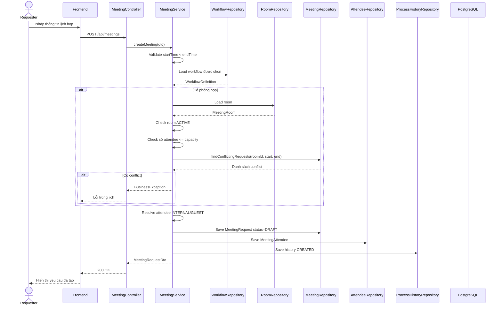
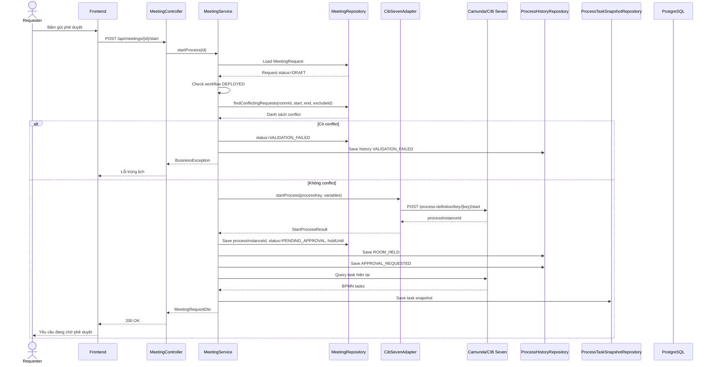
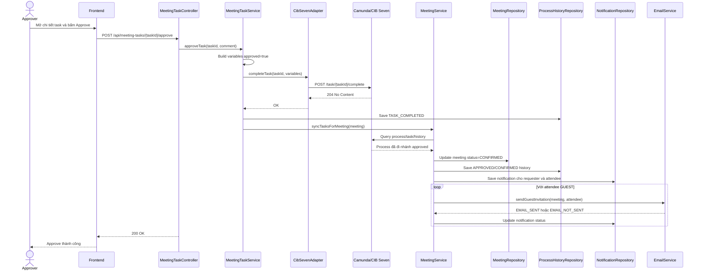
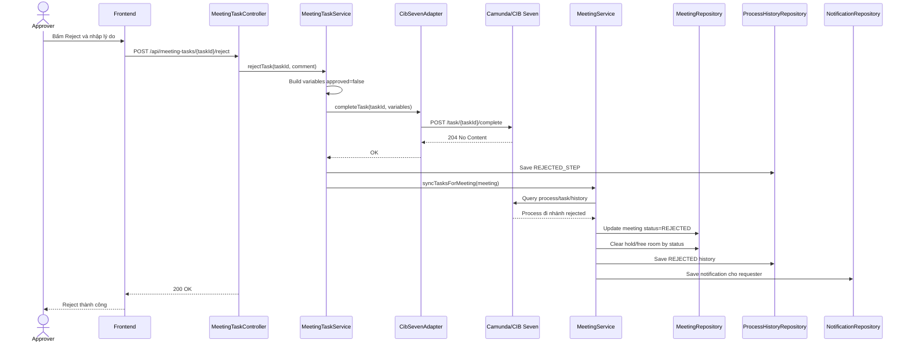
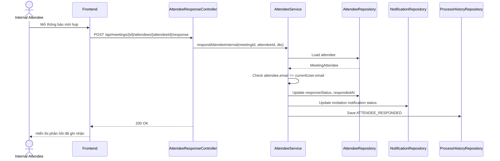
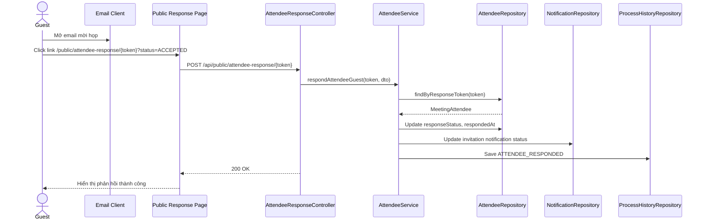

# Tài Liệu Kỹ Thuật FlowPilot

## 1. Tổng Quan Kiến Trúc

FlowPilot gồm bốn khối chính:

```text
React/Vite Frontend
        |
        | HTTP JSON + JWT
        v
Spring Boot Backend  ---- HTTP REST ---- Camunda/CIB Seven Engine
        |
        | JPA/Hibernate
        v
PostgreSQL
```

- Frontend: React, TypeScript, Vite, giao diện theo role `ADMIN`, `REQUESTER`, `APPROVER`.
- Backend: Spring Boot 3, Java 17, Spring Security JWT, Spring Data JPA.
- BPMN engine: Camunda 7 compatible image, dùng REST API `/engine-rest`.
- Database: PostgreSQL lưu dữ liệu nghiệp vụ; Camunda tự lưu runtime/process metadata trong engine container.

## 2. Cấu Trúc Backend

Backend tổ chức theo domain để mỗi nghiệp vụ có controller/service/dto/entity riêng:

```text
backend/src/main/java/com/vdt/flowpilot
├── auth          # đăng nhập, JWT, role, security
├── bpmn          # adapter REST tới engine và generator BPMN XML
├── common        # cấu hình chung, seed data, response wrapper
├── crypto        # mã hóa dữ liệu nhạy cảm
├── meeting       # yêu cầu họp, attendee, giữ phòng, hết hạn giữ phòng
├── notification  # thông báo cá nhân, email, nhật ký thông báo
├── process       # monitor, process history, task snapshot
├── room          # phòng họp, thiết bị
├── task          # task phê duyệt từ BPMN engine
├── user          # tìm user nội bộ, resolve attendee
└── workflow      # cấu hình workflow động, step, deploy
```

Hai controller admin cũ của phòng và thiết bị đã được gộp vào controller domain:

- `RoomController`: giữ cả `/api/rooms/**` và `/api/admin/rooms/**`.
- `EquipmentController`: giữ cả `/api/equipment/**` và `/api/admin/equipment/**`.

URL API không đổi, chỉ giảm file trùng trách nhiệm.

## 3. Luồng Nghiệp Vụ Chính

1. Admin tạo hoặc chỉnh workflow gồm các step `START`, `SERVICE_TASK`, `USER_TASK`, `APPROVE`, `CONDITION`, `END`.
2. Backend sinh BPMN XML bằng `BpmnXmlGenerator`.
3. Admin preview XML và deploy workflow lên Camunda qua `CibSevenAdapter`.
4. Requester tạo yêu cầu lịch họp, chọn phòng, thiết bị, attendee và workflow đã deploy.
5. Backend kiểm tra thời gian, phòng active, sức chứa, thiết bị thuộc phòng và trùng lịch.
6. Requester start process. Backend tạo process instance, lưu `processInstanceId`, chuyển trạng thái sang `PENDING_APPROVAL`, đặt `holdUntil`.
7. Approver/Admin nhận task, claim task và approve/reject.
8. Backend hoàn thành task trên engine, cập nhật meeting, ghi `ProcessHistory`, gửi notification/email.
9. Internal attendee phản hồi qua notification. Guest attendee phản hồi qua link public trong email.
10. Admin theo dõi trạng thái trong monitor dashboard và Camunda Cockpit.

## 4. Sequence Diagram Các Luồng Chính

### 4.1. Tạo Yêu Cầu Lịch Họp



Ý chính: tạo request mới chỉ lưu trạng thái `DRAFT`. Phòng chưa chính thức được giữ cho đến khi requester start process.

### 4.2. Gửi Phê Duyệt Và Tạm Giữ Phòng



Ý chính: hệ thống check trùng lịch lần hai ngay trước khi giữ phòng. Sau khi BPMN start thành công, request chuyển sang `PENDING_APPROVAL` và `holdUntil` được set.

### 4.3. Approve Yêu Cầu



Ý chính: approve không chỉ đổi trạng thái local. Backend complete task trên BPMN engine với biến `approved=true`, để gateway trong BPMN đi đúng nhánh thành công.

### 4.4. Reject Yêu Cầu



Ý chính: reject gửi biến `approved=false` về BPMN engine. Khi meeting chuyển sang `REJECTED`, request không còn được tính là chiếm phòng trong rule check trùng lịch.

### 4.5. Attendee Nội Bộ Phản Hồi



Ý chính: internal attendee bắt buộc đăng nhập và chỉ được phản hồi cho email thuộc tài khoản hiện tại.

### 4.6. Guest Phản Hồi Qua Email



Ý chính: guest không cần đăng nhập. Token trong email là khóa định danh để tìm đúng attendee record.

## 5. Workflow Động Và BPMN Generator

Workflow được lưu trong database qua các bảng:

- `workflow_definitions`: thông tin workflow, process key, trạng thái deploy.
- `workflow_steps`: danh sách bước xử lý và thứ tự.
- `workflow_form_fields`: field động cũ vẫn có trong entity/DTO để tương thích dữ liệu, nhưng API form-field đã bị loại bỏ vì UI hiện chưa sử dụng.

`BpmnXmlGenerator` sinh BPMN theo cấu hình step:

- `START` -> `bpmn:startEvent`.
- `SERVICE_TASK` -> `bpmn:serviceTask`.
- `USER_TASK`/`APPROVE` -> `bpmn:userTask` với `camunda:candidateGroups`.
- `CONDITION` -> `bpmn:exclusiveGateway` và sequence flow rẽ nhánh.
- `END` -> `bpmn:endEvent`.

Với step `CONDITION`, `configJson` cần chỉ rõ biến và target:

```json
{
  "variable": "approved",
  "trueTarget": "confirm_meeting",
  "falseTarget": "cancel_hold"
}
```

Generator cũng sinh BPMNDI shape/edge để Camunda Cockpit hiển thị mũi tên và nhánh điều kiện dễ nhìn.

Lưu ý: workflow động quyết định cấu trúc BPMN. Logic nghiệp vụ thực tế như kiểm tra phòng, giữ phòng, approve/reject, gửi thông báo vẫn nằm trong backend. Nếu muốn thêm một bước service task có nghiệp vụ hoàn toàn mới, cần bổ sung code backend hoặc delegate/adapter tương ứng.

## 6. Giữ Phòng Và Tự Hủy Khi Hết Hạn

Thời gian giữ phòng được cấu hình bằng:

- `app.meeting-hold.duration-minutes`, mặc định 15 phút.
- `app.meeting-hold.expiration-scan-ms`, mặc định 60000 ms.

Khi process được start:

- meeting chuyển sang `PENDING_APPROVAL`;
- `holdUntil` được set;
- phòng bị tính là bận trong các lần kiểm tra trùng lịch.

Rule check trùng phòng:

```text
same room
AND (status = CONFIRMED OR status = PENDING_APPROVAL AND holdUntil > now)
AND existing.startTime < new.endTime
AND existing.endTime > new.startTime
```

`RoomHoldExpirationService` chạy định kỳ. Nếu request còn `PENDING_APPROVAL` và `holdUntil` đã qua:

- chuyển meeting sang `REJECTED`;
- ghi lịch sử `ROOM_HOLD_EXPIRED`;
- gửi notification cho requester;
- request không còn được coi là chiếm phòng trong rule check trùng lịch.

## 7. Email Mời Họp Cho Guest

Khi meeting được approve, backend tạo notification cho requester và từng attendee. Với attendee `GUEST`, hệ thống có thể gửi email thật nếu `APP_MAIL_ENABLED=true`.

Thành phần liên quan:

- `EmailService`: dựng email HTML và gửi qua `JavaMailSender`.
- `MeetingService.sendMeetingConfirmedNotifications`: sau khi tạo notification guest, gọi `EmailService.sendGuestInvitation`.
- `PublicAttendeeResponsePage`: nhận token public và query `status`; nếu status hợp lệ thì tự ghi nhận phản hồi.

Email guest có 3 link tương ứng:

- `ACCEPTED`: đồng ý tham gia.
- `TENTATIVE`: có thể tham gia.
- `DECLINED`: từ chối tham gia.

Ví dụ link:

```text
https://flowpilot.company.com/public/attendee-response/{token}?status=ACCEPTED
```

`APP_FRONTEND_URL` phải là URL mà guest truy cập được. Nếu để `http://localhost:3000`, link chỉ dùng được trên máy đang chạy frontend local.

SMTP có thể dùng:

- Gmail/Google Workspace: cần App Password hoặc SMTP relay.
- Microsoft 365: cần SMTP AUTH hoặc relay được quản trị viên cho phép.
- SendGrid/Mailgun/Amazon SES: phù hợp môi trường production.
- SMTP nội bộ công ty: phù hợp nếu công ty đã có mail gateway.

Nếu gửi mail thất bại hoặc chưa bật mail, meeting vẫn không bị fail. Notification guest được lưu với status `EMAIL_NOT_SENT`; nếu gửi thành công là `EMAIL_SENT`.

## 8. Retry Và Xử Lý Lỗi Tích Hợp

### BPMN Engine

`CibSevenAdapter` dùng Resilience4j:

```java
@Retry(name = "bpmnEngine")
```

Cấu hình:

```yaml
resilience4j:
  retry:
    instances:
      bpmnEngine:
        maxAttempts: 3
        waitDuration: 1s
```

Các thao tác deploy/start/query/claim/complete task đều đi qua adapter này. Nếu engine lỗi tạm thời, backend retry tối đa 3 lần. Nếu vẫn fail, service trả lỗi nghiệp vụ cho frontend.

### Email

Email hiện được xử lý theo hướng fail-soft:

- gửi thành công: notification status `EMAIL_SENT`;
- gửi thất bại: log lỗi và set `EMAIL_NOT_SENT`;
- không rollback kết quả approve meeting.

Hướng production có thể nâng cấp bằng retry riêng cho email hoặc outbox pattern để retry nền và tránh gửi trùng.

## 9. Trạng Thái Chính

Meeting request:

- `DRAFT`: mới tạo, chưa start process.
- `PENDING_APPROVAL`: đang chờ phê duyệt và đang giữ phòng.
- `CONFIRMED`: đã phê duyệt.
- `REJECTED`: bị từ chối hoặc hết hạn giữ phòng.
- `CANCELLED`: bị hủy.
- `FAILED`/`VALIDATION_FAILED`: lỗi nghiệp vụ hoặc lỗi start process.

Attendee response:

- `PENDING`
- `ACCEPTED`
- `DECLINED`
- `TENTATIVE`

Workflow:

- `DRAFT`: cấu hình chưa deploy.
- `DEPLOYED`: đã deploy lên engine và có thể chọn khi tạo meeting.

## 10. Dữ Liệu Khởi Tạo

`DataInitializer` seed:

- Roles: `ADMIN`, `REQUESTER`, `APPROVER`.
- Users demo: `admin`, `requester01`, `approver01`, `user01`.
- Thiết bị mẫu: projector, micro, whiteboard, TV screen, video conference.
- Phòng mẫu: `ROOM_A101`, `ROOM_B201`, `ROOM_ONLINE`.
- Workflow mẫu: `MEETING_SCHEDULING_WORKFLOW`.

## 11. Quy Ước Dọn Dẹp Source

Không nên commit các thư mục sinh ra:

- `backend/target/`
- `frontend/dist/`
- `frontend/node_modules/`

Root `.gitignore` đã loại các thư mục này. Các package backend hiện nhiều nhưng đang bám theo domain nghiệp vụ, nên không nên ép gộp cơ học nếu không có lý do rõ ràng vì sẽ làm tăng rủi ro vỡ import và security rule.
